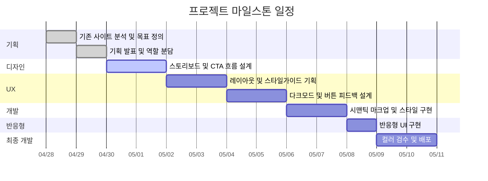
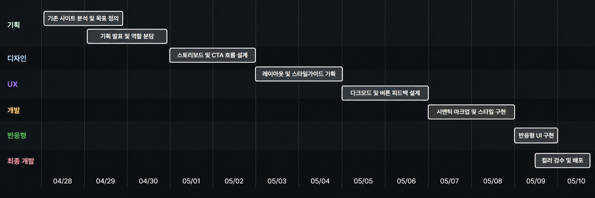
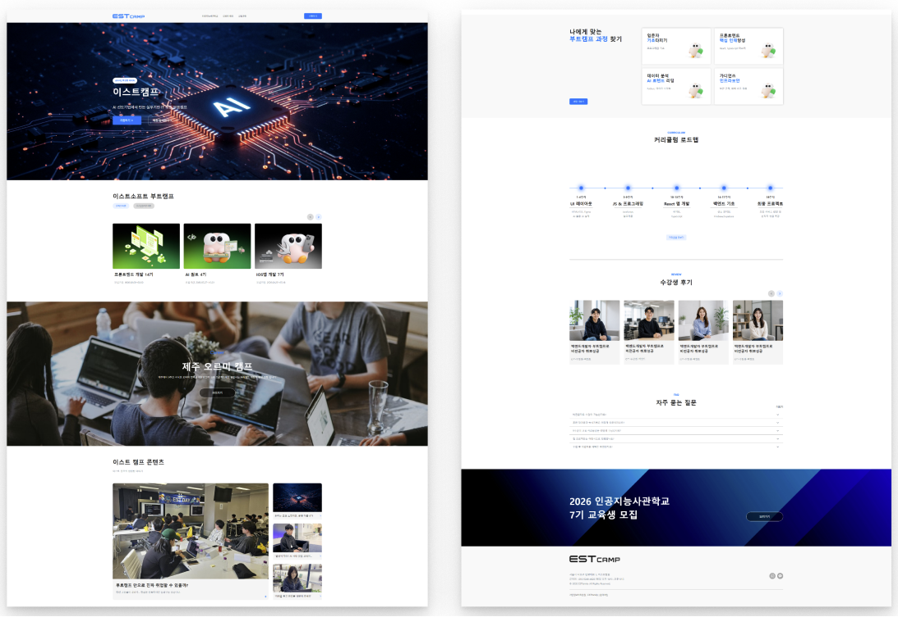

# Minimal Portfolio(1차 프로젝트)

- 과정명: 오르미 프론트엔드 개발(React/HTML/CSS/JavaScript/chatGPT)
- 기간: 2026/04/07 ~ 2026/08/21
- 1차 프로젝트: 2026/04/30 ~ 2025/05/12

## 🔗 빠른 링크

- 📑 발표자료(피그마 슬라이드): https://www.figma.com/slides/3fGwqaATJbrSOLdC2unmDS
- 🎨 [디자인 원본(피그마)]: (https://www.figma.com/design/P2V2amlhfA6swbLa8wxyK0/5%ED%8C%80-%EC%A4%91%EA%B3%A0%EB%89%B4%EB%B9%84?t=ZvBDUw5EED1I2em1-0)

## 1. 프로젝트 개요

### 1.1 목표

- **실무형 사이트 구현**: HTML, CSS를 실제 서비스 형태의 메인 페이지 및 인터랙션 구현
- **디자인 역량강화**: Figma 디자인 시안을 기반으로 레이아웃, 컴포넌트, 슬라이드 UI 등을 직접 구현
- **협업 경험**: Git/GitHub를 활용한 브랜치 전략 및 팀 협업 프로세스 경험
- **반응형 및 접근성 개선** : 기존 사이트 장단점 분석을 통해 편의성 향상 및 다양한 디바이스 환경에서도 최적화된 화면 제공

### 1.2 👥 팀원

| 이름 | 역할 | 주요 담당 | GitHub | 연락 |
| 조영빈 | 팀장 | 수강생 후기 섹션, Q&A 섹션 HTML/CSS | [@JoYoungBin00](https://github.com/JoYoungBin00) | dudqls_6712@naver.com |
| 박소호 | 팀원 | 피그마 디자인, hero 섹션, 온라인 과정 섹션 HTML/CSS | [@soho1109](https://github.com/soho1109) | garam@example.com |
| 송주윤 | 팀원 | 이스트캠프 hero, 콘텐츠 섹션 디자인 및 HTML/CSS | [@송주윤](https://github.com/Polao63) | hwangdo701@gmail.com |
| 강채희 | 팀원 | 다크모드 시스템 반영, header, 과정 찾기 섹션, 커리큘럼 섹션 HTML/CSS | [@강채희](https://github.com/chae3110) | dldmd33333@gmail.com |
| 최이리나 | 팀원 | 하단 CTA, footer HTML/CSS | [@최이리나](https://github.com/tsoyirina48-ai) | tsoyirina48@gmail.com |

### 1.3 🗓️ 마일스톤

#### 1일차 — 기획 (2026/04/28)

- [ ] 기존 사이트 분석·개발 목표 정의 (Figma 슬라이드)

#### 2일차 — 기획 발표 (2026/04/29)

- [ ] 1일차 내용 발표(리뉴얼 방향,역활 분담)

#### 3일차 — Figma 디자인 최종기획 (2026/04/30)

- [ ] 스토리보드 제작(사용자 행동 중심 레이아웃 구조,주요기능 기획)
- [ ] CTA 흐름 설계(탐색->고민->행동)

#### 4~5일차 — 레이아웃, 스타일가이드 기획 (2026/05/03 ~ 2026/05/04)

- [ ] 레이아웃,섹션 기획 및 제작
- [ ] 스타일 가이드 기획

#### 6~7일차 — UX기획 (2026/05/05 ~ 2026/05/06)

- [ ] 테마 설정(화이트모드 , 다크모드)
- [ ] 버튼 및 카드 섹션의 마우스 클릭 및 호버 상태 설계(버튼 피드백)
- [ ] 섹션 간 이미지 확장자 규정(웹 최적화)

#### 8~9일차 — 개발 (2026/05/07 ~ 2026/05/08)

- [ ] 시맨틱 HTML 마크업 구조화를 활용한 레이아웃 구현
- [ ] 버튼 피드백 강화
- [ ] 폰트,컬러등 스타일 css 제작
- [ ] 코드 검수

#### 10일차 (2026/05/09)

- [ ] 반응형 구현

#### 11일차 — 최종 개발 (2026/05/10)

- [ ] 라이트/다크모드 컬러 검수
- [ ] 코드검수
- [ ] 배포

[]

<!--

-->

[]

### 1.4 주요 기능

####

- 사용자 행동 유도형 정보전달
- 섹션별 핵심정보 배치로 정보전달

#### 프로젝트 관리

- 프로젝트 등록(제목, 설명, 대표 이미지, 상세 이미지, URL, 리뷰 등)
- 이미지 업로드(Supabase Storage)
- 목록/상세 페이지 구현
- 이미지 확장자 구분 저장

#### 🔍 부가 기능

- 반응형 레이아웃(모바일·태블릿·데스크톱 대응)

---

## 2. 개발 환경 및 배포

### 2.1 개발 스택

#### Frontend

- **Language**: HTML / CSS
- **Styling**: CSS Modules / Tailwind CSS

#### Tools

- **Version Control**: Git & GitHub (테스트 및 배포)
- **Coding**: VS Code
- **Design**: Figma

### 2.2 배포 URL

- [배포링크](https://polao63.github.io/est_fe_13_1st_project/)

### 2.3 📚 개발 컨벤션 가이드

프로젝트에서 사용하는 HTML, CSS, JavaScript 작성 규칙은 아래 문서를 참고하세요.

## 3. 라우팅 구조

| 경로          | 설명                   | 접근 권한 |
| ------------- | ---------------------- | --------- |
| `/`           | 메인 홈(프로젝트 목록) | 전체      |
| `/index.html` | 메인 페이지            | 전체      |
| `/about.html` | 서브 페이지            | 전체      |

---

## 4. 프로젝트 구조

```
est_fe_13_1st_project/
├── css/
│ ├── common.css
│ ├── index.css
│ ├── normalize.css
│ └── reset.css
│
├── images/
│ ├── banner.png
│ ├── hero-banner.jpg
│ ├── logo.png
│ ├── student1.png
│ └── ...
│
├── about.html
├── index.html
└── README.md
```

---

## 5. 향후 개선 사항

- 추후 Js를 사용하여 슬라이드, 아코디언등 사용
- 반응형 UI 수정, 링크 추가
- 코드를 더 간결하게 작성
- 모바일 반응형 구조레이아웃 배치

## 6. 제작 후기

이 프로젝트를 통해 트랜드와 접근성을 보완한 웹사이트를 제작 할 수 있었습니다
팀 프로젝트를 진행하며 GitHub를 통한 협업 과정을 경험할 수 있었습니다

## 8. 기획/디자인 문서

- **발표 슬라이드(피그마 슬라이드)**
  링크: https://www.figma.com/slides/3fGwqaATJbrSOLdC2unmDS
- **디자인 원본(피그마)**: 컴포넌트, 컬러/타이포 스케일, 반응형 레이아웃, 아이콘  
  링크: https://www.figma.com/design/P2V2amlhfA6swbLa8wxyK0/5%ED%8C%80-%EC%A4%91%EA%B3%A0%EB%89%B4%EB%B9%84?t=jE309G4VdmHFIDVP-0

### 9. 미리보기

<!-- /public/readme/ 폴더에 썸네일 PNG를 넣고 경로를 맞춘다 -->

[](https://www.figma.com/slides/3fGwqaATJbrSOLdC2unmDS "피그마 슬라이드로 이동")
[](https://www.figma.com/design/P2V2amlhfA6swbLa8wxyK0/5%ED%8C%80-%EC%A4%91%EA%B3%A0%EB%89%B4%EB%B9%84?t=jE309G4VdmHFIDVP-0 "피그마 디자인으로 이동")
